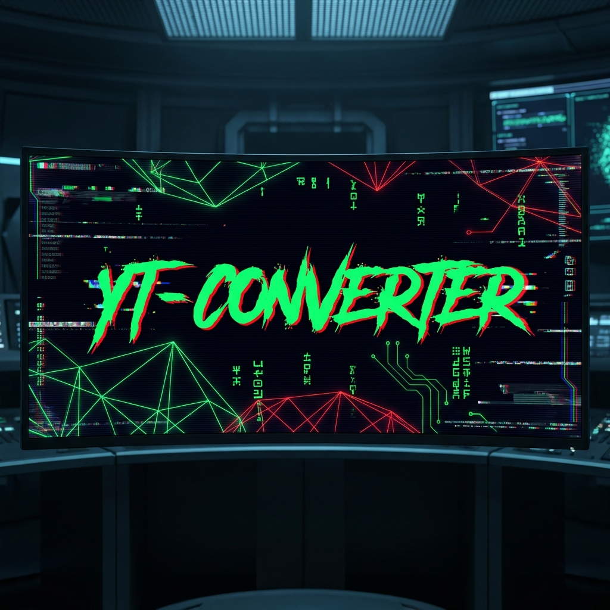

<div align="center">
  
</div>

<div align="center">
  
  [](https://laravel.com)
  [](https://reactjs.org)
  [](https://microsoft.com)
  []()

  <br />

  <h1>// YT-CONVERTER //</h1>
  <h3>ADVANCED MEDIA EXTRACTION PROTOCOL</h3>

  <p>
    <i>"A high-velocity interface for extracting raw audio and visual data. Engineered for archivists."</i>
  </p>
</div>

---

## [ 001 ] // SYSTEM_ARCHITECTURE

**YT-CONVERTER** is a monolithic media extraction tool designed to bypass standard restrictions and deliver high-fidelity data. It fuses a **Laravel 11** backend with a reactive **React** frontend, utilizing `yt-dlp` and `ffmpeg` binaries for precision processing.

> [!NOTE]
> **AESTHETIC PROTOCOL: CYBERSIGILISM**
> The interface uses a strict comprehensive design language characterized by dark modes, glitch effects, and raw data visualization.

## [ 002 ] // CORE_CAPABILITIES

-   **[ RESOLUTION_MATRIX ]**: Supports up to **4K (2160p)** video extraction.
-   **[ CONTAINER_FLEXIBILITY ]**: Native support for **MP4** and **MKV** formats.
-   **[ AUDIO_EXTRACTION ]**: High-bitrate MP3/Vorbis conversion.
-   **[ BINARY_FUSION ]**: Native `ffmpeg` integration for proper video/audio merging (Fixed silent audio issues).
-   **[ AUTO_PATCHING ]**: Self-healing environment variables to prevent `yt-dlp` conflicts on Windows systems.

## [ 003 ] // INSTALLATION_PROTOCOL (WINDOWS)

Follow this sequence to initialize the system on a local Windows environment.

### PHASE 1: INFILTRATION
```powershell
# Clone the repository
git clone https://github.com/Eustakius/yt-converter.git
cd yt-converter
```

### PHASE 2: DEPENDENCY_INJECTION
```powershell
# Install backend dependencies
composer install

# Install frontend dependencies
npm install
```

### PHASE 3: ENVIRONMENT_CONFIGURATION
```powershell
# Initialize environment file
copy .env.example .env

# Generate application encryption key
php artisan key:generate

# Initialize local database
# Ensure 'database/database.sqlite' exists (create if missing)
type nul > database/database.sqlite
php artisan migrate
```

### PHASE 4: BINARY_ACQUISITION (CRITICAL)
The system requires specific Windows executables to function.
1.  Download **`ffmpeg.exe`** and **`ffprobe.exe`** (from gyan.dev).
2.  Download **`yt-dlp.exe`** (from github.com/yt-dlp/yt-dlp).
3.  Place all three files into the project's **`/bin`** directory.
    -   `.../yt-converter/bin/ffmpeg.exe`
    -   `.../yt-converter/bin/ffprobe.exe`
    -   `.../yt-converter/bin/yt-dlp.exe`

> **[ SYSTEM_UPDATE ]**: The `YouTubeController` has been patched to automatically direct to `.exe` paths on Windows and sanitize `PYTHONHOME` environment variables to prevent initiation errors.

### PHASE 5: SYSTEM_IGNITION
```powershell
# Launch the full stack (Laravel Server + Vite Hot Reload)
npm start
```

Target URL: `http://127.0.0.1:8000`

---

## [ 004 ] // TROUBLESHOOTING

| ERROR CODE | DIAGNOSIS | RESOLUTION |
| :--- | :--- | :--- |
| **500 SYSTEM ERROR** | `yt-dlp.exe` failed to start. | Ensure binaries are in `/bin`. The auto-patcher should handle path issues. |
| **NO AUDIO** | FFmpeg merge failure. | **RESOLVED:** System auto-converts audio to AAC for MP4 compatibility. |
| **PYTHON INIT FAIL** | Environment variable leak. | **RESOLVED:** The system now automatically unsets `PYTHON` env vars before execution. |

---

## [ 005 ] // LEGAL_DISCLAIMER

> [!WARNING]
> **COMPLIANCE_CHECK**: This tool is for educational purposes and personal archiving only. The user assumes full liability for all data extraction activities. Respect copyright protocols.
